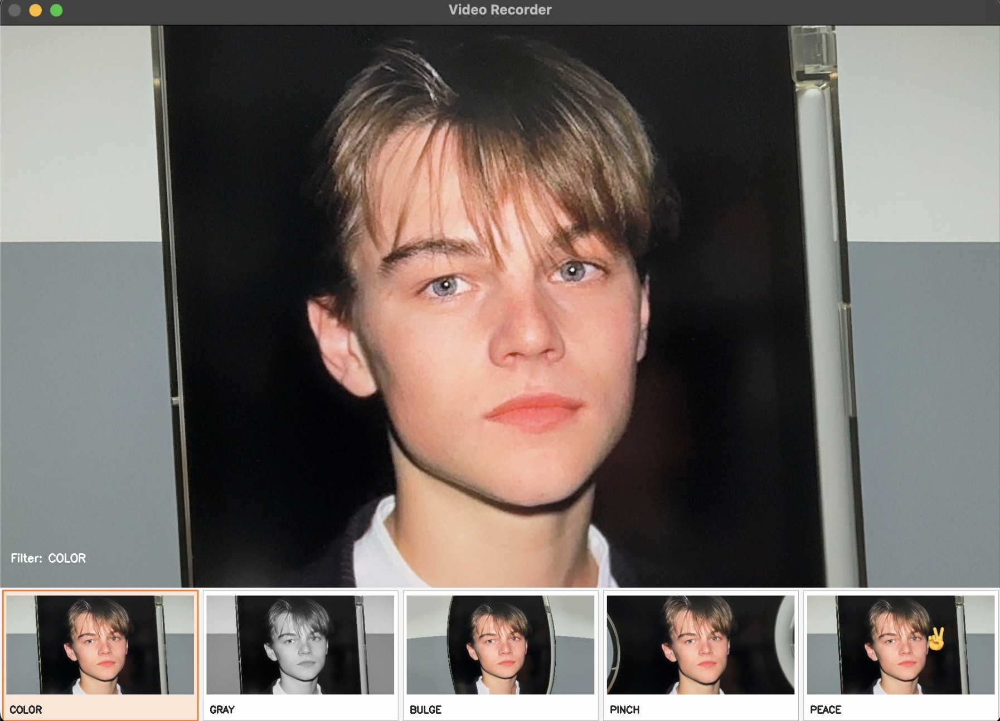

# OpenCV Video Recorder

OpenCV를 이용한 **실시간 카메라 영상 녹화 프로그램**입니다.  
카메라 영상을 **실시간으로 화면에 표시**하고 다양한 **실시간 필터**를 적용할 수 있으며  
녹화 기능을 통해 영상을 파일로 저장할 수 있습니다.

---

## 🎬 Demo Video

▶ [시연 영상 보기](demo/demo.mp4)

---

## 🖥 Program Preview

---

# ✨ Features

## 1. Real-time Camera Preview

OpenCV의 `cv2.VideoCapture`를 사용하여  
카메라 영상을 **실시간으로 화면에 표시**합니다.

---

## 2. Recording Mode

키보드를 통해 **Preview / Record 모드**를 전환할 수 있습니다.

| Key | Function |
|----|----|
| Space | Preview ↔ Record 모드 전환 |
| ESC | 프로그램 종료 |

Record 모드에서는 화면 좌측 상단에 **🔴 REC 타이머**가 표시됩니다.

Preview 모드로 돌아가면 녹화가 종료되고 영상 파일이 저장됩니다.

---

## 3. Video Saving

녹화된 영상은 `recordings` 폴더에 **mp4 파일**로 저장됩니다.

파일 이름 형식 -> record_YYYYMMDD_HHMMSS.mp4

프로그램 실행 시 `recordings` 폴더가 없으면 **자동으로 생성됩니다.**

---

## 4. Real-time Filters

화면 하단에 **필터 미리보기 UI**가 표시되며  
각 필터의 썸네일을 **마우스로 클릭하여 실시간으로 필터를 변경**할 수 있습니다.

지원 필터

| Filter | Description |
|------|------|
| COLOR | 기본 컬러 영상 |
| GRAY | 흑백 필터 |
| BULGE | 볼록 렌즈 효과 |
| PINCH | 오목 렌즈 효과 |
| PEACE | 얼굴 인식 후 눈 옆에 브이 스티커 표시 |

---

## 5. Filter Strength Control

BULGE와 PINCH 필터에서는 왜곡 강도를 조절할 수 있습니다.

| Key | Function |
|----|----|
| + | 필터 강도 증가 |
| - | 필터 강도 감소 |

---

## 6. PEACE Sticker Filter

OpenCV의 **Haar Cascade**를 이용하여 얼굴과 눈을 검출합니다.

검출된 눈 위치를 기준으로 **화면 기준 오른쪽 눈 옆에 브이 스티커를 표시**합니다.

눈 검출이 실패할 경우에는 얼굴 위치를 기준으로 **대략적인 위치에 스티커를 표시**하도록 설계되어 있습니다.

사용된 Cascade 모델

- `haarcascade_frontalface_default`
- `haarcascade_eye`

---

# ⚙ Performance Optimization

BULGE와 PINCH 필터에서는 **왜곡 좌표(distortion map)를 캐싱**하여  
매 프레임마다 다시 계산하지 않도록 최적화하였습니다.

이를 통해 실시간 영상 처리에서도 **성능 저하 없이 필터를 적용**할 수 있습니다.

---

## 🛠 Technologies

- Python
- OpenCV
- NumPy

---

